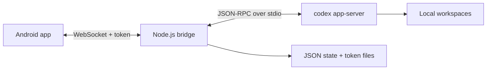

# Codex Remote Control

Codex Remote Control is a small self-hosted bridge plus Android client for controlling Codex sessions from a phone on a private network.

The Linux/macOS host runs a Node.js WebSocket bridge. The Android app connects to that bridge, lists sessions, sends prompts, streams assistant output, handles approvals, and reads changed files or diffs from the active workspace.

This project is designed for personal/private-network use. It is not a hosted relay, multi-user service, or hardened public internet gateway.

## Features

- Thin Node.js bridge for `codex app-server --listen stdio://`
- Mock backend for local testing and Android UI development
- Token-protected WebSocket API
- Session list, start, resume, content snapshot, and incremental sync
- Streaming Codex events and approval request/response forwarding
- Session-scoped file reads for Android code and diff browsing
- Android client built with Kotlin, Jetpack Compose, and OkHttp WebSocket

## Architecture



See [Architecture](docs/architecture.md) for the component split and data flow.

## Quick Start

Install Node.js 20 or newer, Android Studio or a JDK-compatible Android build environment, and the Codex CLI on the bridge host.

```bash
npm install
npm run bridge
```

The bridge prints one or more URLs like:

```text
ws://192.168.1.10:8787/?token=...
```

By default the bridge stores its token, bridge id, state, and optional sync logs under `~/.config/codex_remote_control/`.

Build the Android debug APK:

```bash
npm run apk
```

Install `android/app/build/outputs/apk/debug/app-debug.apk`, open the app, and paste the bridge URL.

Build the Android release APK:

```bash
npm run apk:release
```

The release build outputs `android/app/build/outputs/apk/release/app-release-unsigned.apk`.
Sign it before distributing beyond local/private use.

More setup options are documented in [Usage](docs/usage.md).

## Development

Run bridge tests:

```bash
npm test
```

Compile Android Kotlin:

```bash
source ~/.zshrc && cd android && ./gradlew :app:compileDebugKotlin
```

See [Development](docs/development.md) for repository layout, validation commands, and generated-code notes.

## Documentation

- [Usage](docs/usage.md): bridge startup, environment variables, APK build, and debug logging
- [Architecture](docs/architecture.md): bridge, backend, state, and Android responsibilities
- [Protocol](docs/protocol.md): HTTP endpoints, WebSocket envelope, client messages, and events
- [Approval Flow](docs/approval-flow.md): approval request/response behavior and troubleshooting
- [Session Incremental Sync](docs/session-incremental-sync.md): `session.sync` design and fallback rules
- [Android README](android/README.md): Android client implementation notes
- [Changelog](CHANGELOG.md): release notes and artifact paths
- [Project Plan Archive](docs/project-plan.md): original personal implementation plan

## Security

The bridge can control Codex sessions and approve local commands. Bind it only to a trusted private network, keep the token secret, and avoid exposing it directly to the public internet.

See [SECURITY.md](SECURITY.md) for supported reporting and deployment guidance.

## License

GNU General Public License v3.0. See [LICENSE](LICENSE).
