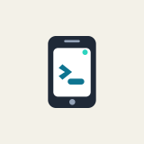
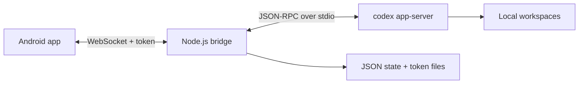

<p align="center">
  
</p>

# Codex Remote Control

[English README](README.md)

Codex Remote Control 是一个自用的 Codex 手机远程控制方案：主机上运行一个轻量 Node.js WebSocket bridge，Android 客户端通过私有网络连接它，用手机查看会话、发送消息、处理审批，并浏览代码变更和 diff。

这个项目面向个人和可信私有网络使用。它不是托管中继服务、多用户系统，也不是面向公网暴露的加固网关。

## 主要功能

- 连接私有网络中的 Codex Bridge
- 查看、切换、恢复 Codex 会话
- 发送消息并流式查看助手回复
- 处理审批请求和文件变更
- 浏览代码文件、diff 和会话变更
- 备份和恢复连接信息与本地设置
- Node.js bridge 对接 `codex app-server --listen stdio://`
- Mock backend 支持本地测试和 Android UI 开发

## 架构



更多细节见 [Architecture](docs/architecture.md)。

## 快速开始

需要在 bridge 主机上安装 Node.js 20 或更新版本、Codex CLI，以及可用的 Android 构建环境。

```bash
npm install
npm run bridge
```

bridge 会输出可粘贴到 Android app 的地址：

```text
ws://192.168.1.10:8787/?token=...
```

默认情况下，bridge 会把 token、bridge id、状态和可选同步日志放在 `~/.config/codex_remote_control/`。

首次构建 APK 前，先创建本机个人签名 key：

```bash
npm run apk:release:setup
```

构建 debug APK：

```bash
npm run apk
```

规范命名产物：

```text
android/app/build/outputs/apk/debug/codex-remote-control-v0.1.0-debug.apk
```

构建 release APK：

```bash
npm run apk:release
```

release 产物：

```text
android/app/build/outputs/apk/release/codex-remote-control-v0.1.0-release.apk
```

debug 和 release APK 都使用本机 `android/release.keystore` 签名，因此使用同一包名和同一签名时可以共享 app 数据并互相覆盖升级。请妥善备份 `android/release.keystore` 和 `android/release-signing.properties`，后续升级必须继续使用同一份 key。

更多配置见 [Usage](docs/usage.md)。

## 开发

运行 bridge 测试：

```bash
npm test
```

编译 Android Kotlin：

```bash
source ~/.zshrc && cd android && ./gradlew :app:compileDebugKotlin
```

更多说明见 [Development](docs/development.md)。

## 文档

- [Usage](docs/usage.md)：bridge 启动、环境变量、APK 构建和调试日志
- [Architecture](docs/architecture.md)：bridge、backend、状态和 Android 职责拆分
- [Protocol](docs/protocol.md)：HTTP 接口、WebSocket envelope、客户端消息和事件
- [Approval Flow](docs/approval-flow.md)：审批请求/响应行为和排查方式
- [Session Incremental Sync](docs/session-incremental-sync.md)：`session.sync` 设计和 fallback 规则
- [Android README](android/README.md)：Android 客户端实现说明
- [Changelog](CHANGELOG.md)：release note 和构建产物路径

## Q&A

### 手机和 bridge 主机不在同一个局域网，网络怎么解决？

推荐自行使用外网穿透或异地组网方案，让手机能访问你的 bridge 主机。可以选择反向隧道、WireGuard、Tailscale、ZeroTier 或其他自维护的 overlay network。不要把 bridge 直接裸露到公网；它可以控制 Codex 会话并审批本地命令，必须放在可信网络里并保护好 token。

## 安全

bridge 能控制 Codex 会话并处理本地命令审批。只建议绑定到可信私有网络，token 不要泄露，不要把它当成公网服务直接暴露。

安全说明见 [SECURITY.md](SECURITY.md)。

## 许可证

GNU General Public License v3.0。见 [LICENSE](LICENSE)。
