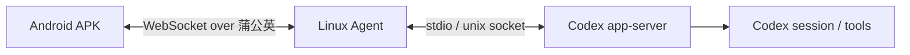
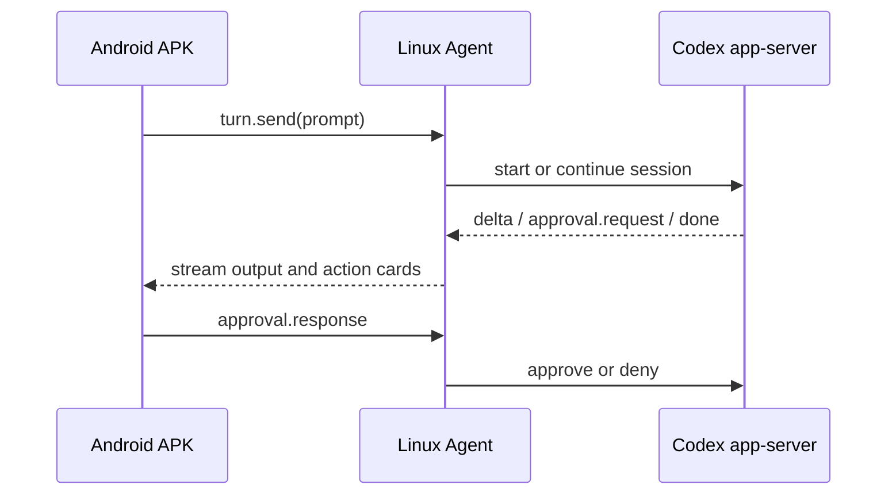

# 自用远程 Codex 控制方案（蒲公英版）

## 1. 目标
做一个自用的“远程手机控制 Codex”系统。

核心能力只有三件事：
- Android APK 能发消息、收消息。
- Linux 端能接管 Codex 会话，并把输出实时转回手机。
- 两端通过贝锐蒲公英的异地组网互联，像局域网一样访问。

## 2. 结论
推荐方案是：**自己写一个薄桥，不直接用 `ccpocket` 作为主实现**。

原因很简单：
- 你已经有蒲公英，连通性问题基本解决了。
- `ccpocket` 的 relay、Tailscale、跨平台全家桶对自用来说偏重。
- 我们真正需要的是一个稳定、可控、可长期维护的 Linux Agent + Android 客户端。

`ccpocket` 可以继续当参考实现，尤其是配对、会话管理、UI 和通知流转。

## 3. 总体架构




## 4. 组件设计

### 4.1 Android APK
当前推荐用最小 Gradle Android 工程实现：Kotlin + Jetpack Compose + OkHttp WebSocket。

这样保留“自己写薄桥”的核心优势，也避免长期维护手写 WebSocket 和手工 APK 打包。Compose 已经用于解决连接页、会话页、消息流和输入法遮挡这些真实移动端体验问题；暂时不引入 Room / Hilt。

主要页面：
- 会话列表
- 对话页
- 审批卡片
- 连接状态页
- 设置页

主要能力：
- 发消息
- 收流式输出
- 显示审批请求并返回结果
- 本地缓存历史消息
- 断线后自动重连

### 4.2 Linux Agent
Linux 端建议写成一个常驻服务。

职责：
- 接收手机消息
- 管理 Codex 会话
- 把消息转给官方 Codex app-server
- 把输出和事件流式回推给手机
- 处理审批与错误
- 保存会话状态和审计日志

推荐实现：
- Node.js + ESM 作为主语言
- systemd 常驻运行
- JSON 文件作为第一版存储，后续可换 SQLite

### 4.3 Codex Backend
Linux Agent 不直接解析终端 ANSI。

优先使用官方 `codex app-server` 的 structured 接口：
- `stdio`
- `unix socket`

只有在官方能力不够时，才考虑 PTY 作为 fallback。

### 4.4 配对与认证
因为是自用，建议先做轻量配对：
- 首次启动时生成一次性 pairing code 或 QR
- 手机扫码后换取长期 device token
- Linux 端只接受白名单设备
- 所有连接都走蒲公英网段，不暴露公网

## 5. 通信协议

### 5.1 外层 transport
Android 和 Linux Agent 之间用 WebSocket。

理由：
- 双向实时
- 适合流式输出
- 断线重连简单
- 消息类型可以统一封装

### 5.2 消息封装
建议统一成 JSON envelope：

```json
{
  "id": "msg_123",
  "type": "turn.send",
  "session_id": "ses_001",
  "timestamp": "2026-05-16T23:14:00+08:00",
  "payload": {
    "text": "帮我检查这个命令"
  }
}
```

建议的事件类型：
- `pair.start`
- `pair.confirm`
- `session.list`
- `session.open`
- `turn.send`
- `turn.delta`
- `turn.done`
- `approval.request`
- `approval.response`
- `file.upload`
- `error`

### 5.3 会话生命周期
1. 手机与 Linux 完成配对。
2. 手机打开一个 session。
3. 手机发送 prompt。
4. Linux Agent 转发给 Codex。
5. Codex 产生流式输出或审批请求。
6. Linux Agent 实时回推到手机。
7. 用户在手机上确认审批或继续追加消息。

## 6. 安全边界

自用场景也要保留最小安全边界：
- 只在蒲公英私网内可访问。
- 只接受已配对设备。
- 每台设备有独立 token。
- 默认人工审批危险操作。
- 保留完整日志，方便回溯。

如果以后要公网访问，再单独加：
- TLS
- 访问控制
- 更严格的设备绑定
- 限流和审计

## 7. 推荐技术栈

### Android
- Kotlin + Jetpack Compose 作为当前最小实现
- Gradle Android Plugin 标准构建
- OkHttp WebSocket
- 后续按需再加 Room / DataStore / WorkManager

### Linux
- Node.js
- WebSocket server
- JSON file store
- systemd
- 官方 Codex app-server 接入层

## 8. 实施里程碑

### M1: Linux Agent POC
- 能连接本地 Codex
- 能收到一条消息并转发
- 能把结果回推到本地客户端

### M2: Android MVP
- 能配对
- 能发消息
- 能看流式输出
- 能显示连接状态
- 已在本机落地一个最小 Gradle debug APK MVP

### M3: 稳定化
- 会话持久化
- 断线重连
- 审批流程
- 错误日志

### M4: 增强能力
- 文件上传
- diff 视图
- 快捷指令
- 多会话管理

## 9. 风险与对策

| 风险 | 影响 | 对策 |
|------|------|------|
| 官方 app-server 协议后续变化 | bridge 需要适配 | 外层协议保持薄，内层单独封装 |
| Android 后台 WebSocket 被系统杀掉 | 断线 | 前台服务/重连/本地缓存 |
| 审批流程过于复杂 | 体验下降 | 先默认人工审批，后面再做白名单 |
| 直接用 PTY 容易解析乱流 | 输出不稳定 | 优先用官方 structured 接口 |
| 蒲公英链路抖动 | 连接中断 | session 恢复与断线重连 |

## 10. 非目标
- 不做公网多租户服务
- 不做 iOS 第一版
- 不做远程桌面
- 不做完整文件同步平台
- 不直接复刻 `ccpocket` 的全套产品形态

## 11. 下一步
当前仓库已经落到 Linux bridge + Android MVP。后续如果继续扩展，优先级建议是：
1. 补配对与设备绑定
2. 补前台服务和后台保活
3. 补文件上传、diff、快捷指令和更完整的会话恢复

## 12. 参考资源
- [OpenAI Codex app-server README](https://github.com/openai/codex/blob/main/codex-rs/app-server/README.md)
- [ccpocket](https://github.com/K9i-0/ccpocket)
- [CodexDroid](https://github.com/siddheshkothadi/codexdroid)
- [codex-app-server](https://github.com/siddheshkothadi/codex-app-server)
- [Relaydex](https://github.com/Ranats/relaydex)
- [Remodex](https://github.com/Emanuele-web04/remodex)
- [codex-remote-control-lab](https://github.com/Sunwood-ai-labs/codex-remote-control-lab)
