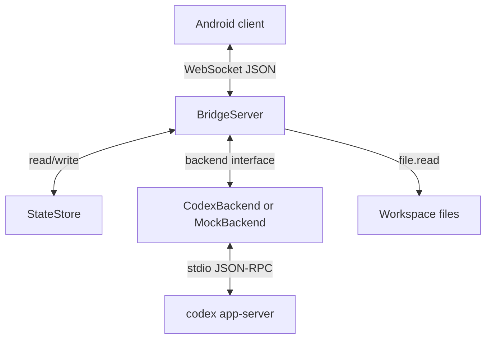

# Architecture

Codex Remote Control has two runtime parts: a local bridge process and an Android client.

## Components



## Bridge

The bridge is a Node.js ESM application. `src/index.mjs` parses CLI options, loads or creates the token, opens the JSON state store, selects a backend, and starts `BridgeServer`.

`BridgeServer` owns:

- HTTP endpoints
- WebSocket authentication and message dispatch
- Event broadcasting
- Approval response forwarding
- Session change notifications

Bridge-specific helpers live under `src/bridge/`.

## Backends

`src/backends/codex.mjs` launches:

```bash
codex app-server --listen stdio://
```

It initializes the app-server, sends JSON-RPC requests, receives notifications and approval requests, and preserves original backend request id types when responding.

`src/backends/mock.mjs` implements the same backend shape for tests and local UI flows.

## State

`src/store.mjs` persists a compact JSON file containing:

- session summaries
- per-session event tails
- pending approvals
- last sequence cursors

The default state file is `~/.config/codex_remote_control/bridge-state.json`. It is local runtime data and is not stored in the repository.

## Session Content And Sync

The Android app treats `session.content` as the authoritative full snapshot. Realtime events are temporary projections until a snapshot or sync response reconciles them.

`session.sync` returns changed turn snapshots since a bridge sequence cursor. If a safe incremental response cannot be built, it sets `needs_full_sync=true` and the Android client falls back to `session.content`.

See [Session Incremental Sync](session-incremental-sync.md) for details.

## Android Client

The Android app uses Kotlin, Jetpack Compose, and OkHttp WebSocket.

Responsibilities are split by file:

- `MainActivity.kt`: lifecycle and top-level state holders
- `MainActivity*Controller.kt`: bridge, protocol, sessions, approvals, snapshots, file changes, settings, and code browser behavior
- `*Page.kt`: page-level Compose UI
- `ConversationHistoryWebView.kt` and related `Conversation*Html.kt` files: chat HTML, markdown, and code rendering
- `CodeBrowserModels.kt` and `CodeBrowserRendering.kt`: code browser parsing and rendering helpers

The Android client keeps chat history in Kotlin-owned `conversationItems`. The WebView renders those items and may patch simple tail updates, but it is not a separate message store.
