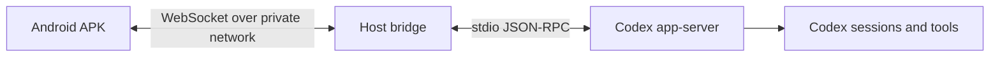
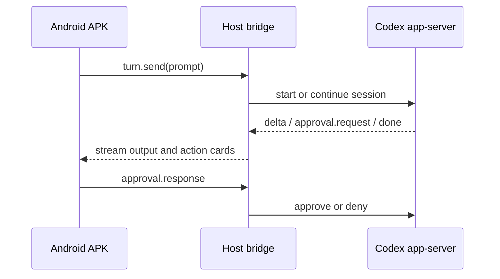

# Original Project Plan

This document archives the original personal implementation plan for Codex Remote Control. It is retained for historical context; current setup and protocol details live in the other docs.

## Goal

Build a personal Android-to-host control path for Codex.

Core capabilities:

- Android APK can send and receive messages.
- A host-side bridge controls Codex sessions and streams output back to the phone.
- Both sides communicate over a private network as if they were on the same LAN.

## Recommended Approach

Use a small custom bridge instead of adopting a full relay product.

Reasons:

- Private networking already solves reachability for the intended deployment.
- A relay, pairing cloud, and cross-platform product layer would be heavy for personal use.
- The needed system is a stable host agent plus Android client.

## High-Level Architecture

## Components

### Android APK

Current implementation uses Kotlin, Jetpack Compose, and OkHttp WebSocket.

Primary screens:

- Session list
- Chat
- Approval UI
- Connection state
- Settings
- Code and diff browser

### Host Bridge

The bridge is a small Node.js process.

Responsibilities:

- Accept phone WebSocket messages
- Manage Codex session state
- Forward requests to Codex app-server
- Stream Codex events back to the phone
- Track pending approvals
- Persist local state

### Codex Backend

The preferred integration is the structured `codex app-server` interface over stdio. PTY parsing is intentionally avoided.

## Security Boundary

Personal use still needs a minimum boundary:

- Private network only
- Token-protected WebSocket
- Manual approval for risky operations
- Local logs only when explicitly enabled

Future public-internet access would require separate hardening such as TLS, stricter access control, rate limiting, and stronger device binding.

## Non-Goals

- Public multi-tenant service
- iOS first version
- Remote desktop
- Complete file sync platform
- Full clone of existing remote-control products

## Future Work

- Pairing and device binding
- Android foreground service or better background reconnection
- File upload
- More complete diff and shortcut workflows
- More robust session recovery around upstream protocol changes
